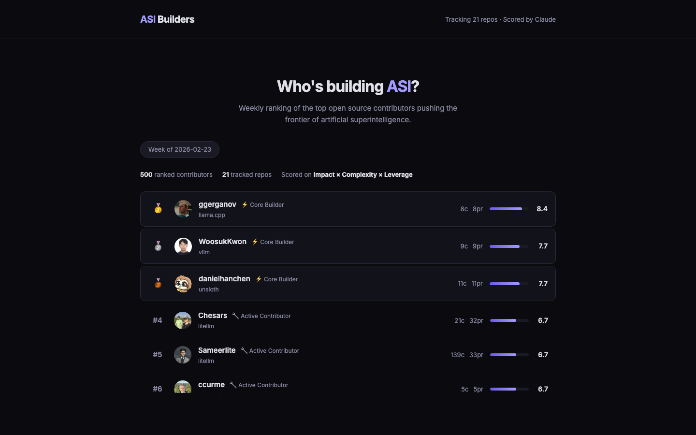

# Who's building ASI?

[](https://domnumb.github.io/asi-builders/) [](https://domnumb.github.io/asi-builders/api/leaderboard.json)

Weekly ranking of the top open source contributors pushing the frontier of artificial superintelligence. Fully automated. Scored by Claude.

**[See the leaderboard →](https://domnumb.github.io/asi-builders/)**



## How it works

Every Monday, an automated pipeline:

1. **Scrapes** GitHub activity across 21 ASI-oriented repos (commits, PRs, reviews, issues)
2. **Scores** each contributor with Claude on 3 dimensions:
   - **Impact** (40%) — Does this work advance AI capabilities, safety, or infrastructure?
   - **Complexity** (30%) — How technically sophisticated is the contribution?
   - **Leverage** (30%) — Could this work accelerate other builders?
3. **Publishes** a static leaderboard with individual profile pages

## Tracked repos

Anthropic, OpenAI, LangChain, LangGraph, AutoGen, CrewAI, LlamaIndex, DeepSeek, Unsloth, HuggingFace Transformers, TRL, LiteLLM, lm-evaluation-harness, vLLM, llama.cpp, and more.

## Find yourself

Every ranked contributor gets:
- A **profile page** with score breakdown and rationale
- An **embeddable badge** for your GitHub README
- **Share buttons** for X and LinkedIn

```md
[](https://domnumb.github.io/asi-builders/u/YOUR_USERNAME/)
```

## Open data

The full leaderboard is available as JSON:

```
GET https://domnumb.github.io/asi-builders/api/leaderboard.json
```

Build on it. No auth required.

## Run it yourself

```bash
cp .env.example .env   # Add GITHUB_TOKEN + ANTHROPIC_API_KEY
pip install -r requirements.txt
python main.py run     # scrape → evaluate → publish → generate site
```

Cost: ~$0.20/week (Haiku) + free GitHub API.

## License

MIT
